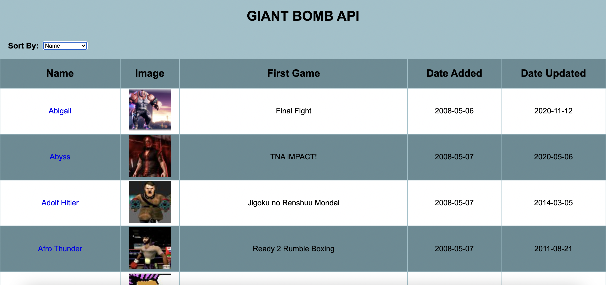
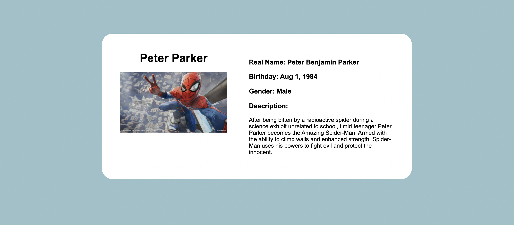

# Deque

The purpose of this assignment was to build an application with React that utilizes the Giant Bomb API to display a table of characters.
When a user clicks on the name of a character, it redirects them to that character's page with more specific info about them.

The table is also able to be sorted by a character's name, the first game they appeared in,
when they were first added to the Giant Bomb API, and when they were last updated.

Disclaimer: This project was bootstrapped with [Create React App](https://github.com/facebook/create-react-app).

To run this code on your local machine, please follow these steps:

```
git clone git@github.com:Litwix/Deque.git
npm install
npm start
```

## Screenshots

All Characters Page:


Single Character Page:

